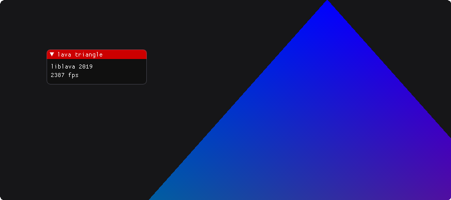
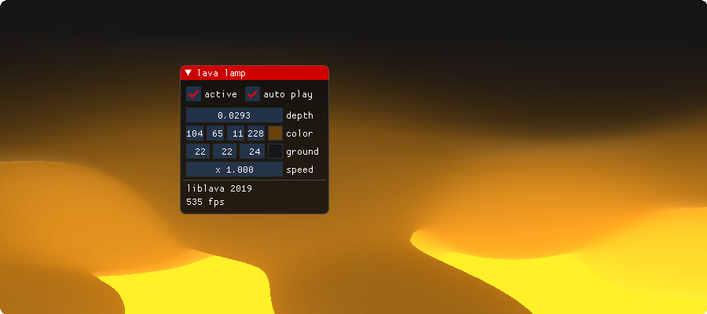
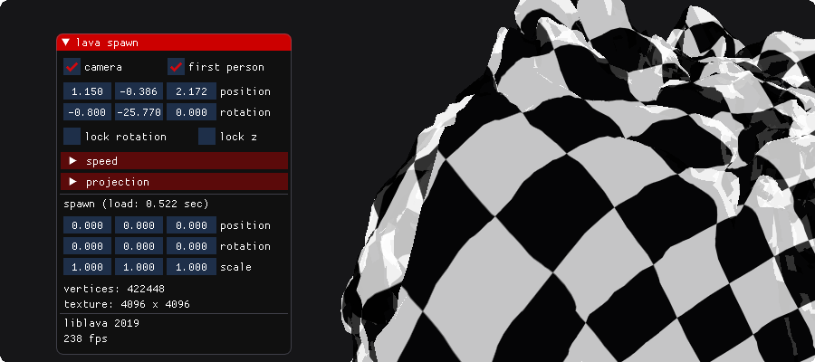

# liblava-demo
Demonstration projects for <a href="https://git.io/liblava">liblava</a>

 [](https://travis-ci.com/liblava/liblava-demo) [](https://ci.appveyor.com/project/TheLavaBlock/liblava-demo) [](LICENSE) [](https://twitter.com/thelavablock)

## demos

##### [lava triangle](https://github.com/liblava/liblava-demo/blob/master/liblava-demo/triangle.cpp) - classic colored mesh
<a href="https://github.com/liblava/liblava-demo/releases"></a>

##### [lava lamp](https://github.com/liblava/liblava-demo/blob/master/liblava-demo/lamp.cpp) - push constants to shader
<a href="https://github.com/liblava/liblava-demo/releases"></a>

##### [lava spawn](https://github.com/liblava/liblava-demo/blob/master/liblava-demo/spawn.cpp) - uniform buffer camera
<a href="https://github.com/liblava/liblava-demo/releases"></a>

## build

```
$ git clone https://github.com/liblava/liblava-demo.git
$ cd liblava-demo

$ git submodule update --init --recursive

$ mkdir build
$ cd build

$ cmake ..
$ make
```

<a href="https://lava-block.com"></a>
